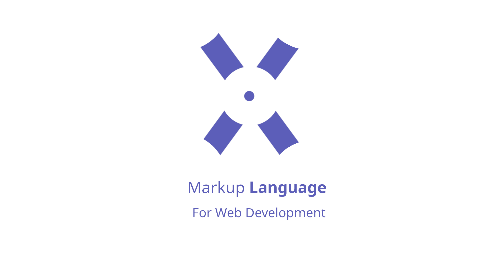

# XALL
Xall is a markup languages which was created to create pre-rendered websites with a lot of ease and flexiblity. XALL Was also designed to be begginer friendly. This repository Contains the XALL and it's compiler/transpiler XTrans's source code.

## Features Of XALL
- Modular Design
- Simple To Read & Write
- Takes Less Time Than Writting Raw HTML
- Very Fast In Compilation
- Pre-Rendered And fast Web-Development
- Fully OpenSource
- Cross-Platform Compatiblity
- No 3rd Party API Or Dependency Required
- Written From Scratch with only C++ and STL (XTrans Feature)

## Cons Of XALL
 - A Completly New Language
 - Has A Learning Curve
 - Relatively New With Small Community

## Installing XALL
For Installing XALL You have 2 ways:-
1. Installing via CLI:
   Installing via CLI is super easy just copy the following commands:-
   ```bash
   git clone https://github.com/darkyboys/XALL.git
   cd XALL
   # configure nautix runtime first
   chmod +x configure-nautix-rt
   ./configure-nautix-rt
   # build
   ./build .
   echo "XALL was successfully installed in the bin directory"
   echo ""
   ```
2. Installing via GUI
   - Download this repository
   - Extract It
   - Open Terminal/CMD/Powershell
   - Fire The following commands
   ```bash
   chmod +x configure-nautix-rt
   ./configure-nautix-rt
   # build
   ./build .
   echo "XALL was successfully installed in the bin directory"
   echo ""
   ```
*Now You can move the XALL file from the bin directory anywhere you want, Tip:- Move the binary to your environment path variable for better accessiblity.*

## Writting Programs In XALL
Writting Programs in XALL is very Simple.

